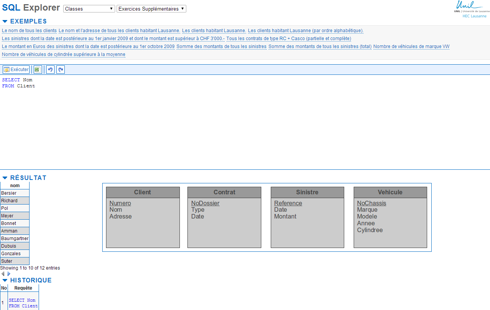
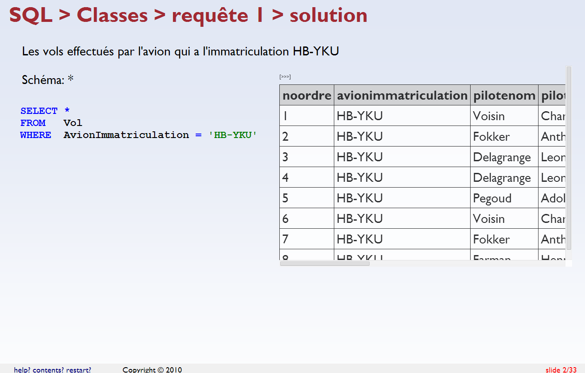

SQL Explorer
============

SQL training support system extracted from a system developed for CS course. Built with CakePhp 1.3 and Postgresql.

Screenshots
----------------

[More screens](https://github.com/bfritscher/sqlexplorer/wiki/Screenshots)

Some Pointers
--------------------
Admins need to create a user account /users/register and login at /admin/index
A user is an admin if his username is in config/bootstrap.php

### Assignment
Assignments represents a separate database (mpe_name_of_assignement) which has tables with data on which SQL questions will be queried

An assignment belongs to a chapter for grouping purpose

An assignment has many questions

Assignments can be sorted in the admin listing

### Question
A question belongs to an assignment and a chapter

A question has a text field which is the questions and an answer field which is a SQL query

A question has a number (no), an optional variant field allows to have the same question number with two variant. For example to have the same answer once with inner join and once without.

When the question is displayed the select schema part is extracted and displayed automatically

If the questions contains a join statement it is also shown in the question, and it is expected that the user's query contains also a join statement.

Only valid SQL questions can be saved

### TP
A TP is a collection of questions from one or more assignment

Once a TP is created questions can be added by going to an assignment view page, checking the questions to add choosing the TP in the dropdown and clicking Add Selected To TP

From a TP page
  *  Moodle SCORM packages can be created (scoURL needs to be configured in controllers/components/i_m_s_manifest.php )
  *  A Slide view is available to interactively correct the exercises with live preview of results
  *  A pdf export of the answers is possible

### QuestionTest
QuestionTest is a function to unit test questions by adding variation of the questions with missing parts. The system will test if theses wrong answer give the same results as the correct one. In this case more data to differentiate both cases have to be added.

### UI behavior Config
If an assignment has the same name as a chapter the questions will be listed as examples (title = question text) and content (SQL query) can by copied into the input field by clicking on them

There are two special chapter which can be defined by specifying their id in bootstrap.php

For it to work their Order No has to be bigger than any other normal chapter

define('ADDITIONAL_ASSIGNEMENTS_CHAPTER_ID', 2);

define('HIDDEN_ASSIGNMENTS_CHAPTER_ID', 3);